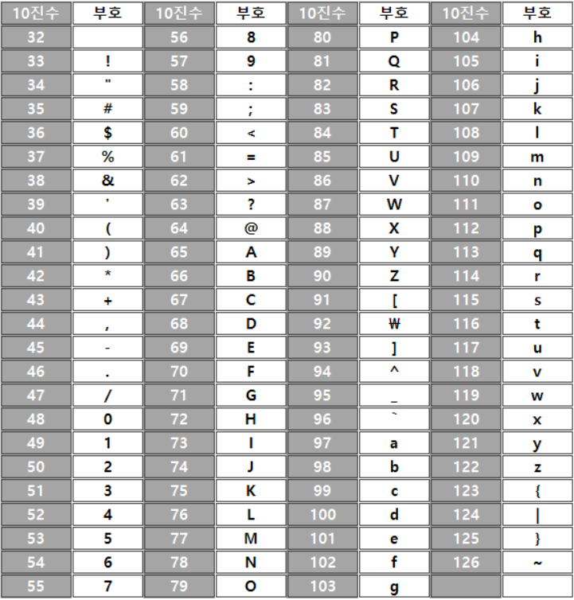

- 자바에서 문자열 a = "1234" 가 있을때, a.charAt(0)과 a.charAt(0) - '0'의 차이

문자열 "1234"에서 a.charAt(0)은 문자열에서 인덱스가 0인 위치에 있는 문자 '1'을 반환합니다.

반면에, a.charAt(0) - '0'은 문자열에서 인덱스가 0인 위치에 있는 문자 '1'의 아스키 코드 값에서 문자 '0'의 아스키 코드 값을 뺀 결과인 정수 1을 반환합니다.

즉, a.charAt(0)은 해당 위치의 문자를 반환하는 반면, a.charAt(0) - '0'은 해당 위치의 문자를 숫자로 변환한 값을 반환합니다.

따라서, a.charAt(0)과 a.charAt(0) - '0'의 차이는 문자와 숫자 간의 변환을 나타내는 것입니다.

- 문자열 a 가 "abcd"라면, 두 개의 차이

문자열 "abcd"에서 a.charAt(0)은 문자열에서 인덱스가 0인 위치에 있는 문자 'a'를 반환합니다.

a.charAt(0) - '0'는 'a'와 '0' 사이의 아스키 코드 값 차이를 계산하므로, 정의되어 있지 않은 동작으로 인해 예외가 발생합니다. 이는 'a'를 아스키 코드 값으로 변환하면 97이 되고, '0'의 아스키 코드 값인 48을 뺀 결과인 49가 반환됩니다. 이 값은 'a'와 '0' 사이의 아스키 코드 값 차이가 아니기 때문에 의미 있는 결과가 아닙니다.

따라서, 문자열에서 숫자로 변환할 수 있는 문자열을 처리하는 경우에만 a.charAt(0) - '0'을 사용해야 합니다. 그렇지 않은 경우에는 각 문자에 대해 적절한 변환 함수를 사용하여 문자열을 처리해야 합니다.

- 아스키 코드 표



- 자주 사용하는 조건 코드

소문자만

```java
if (ch >= 'a' && ch <= 'z')
```

대문자만

```java
if (ch <= 'A' && ch <= 'Z')
```

숫자만

```java
if (ch >= '0' && ch <= '9')
```

특정 특수문자

```java
if (ch == '.' || ch == '-')
```

출처 : [https://jfbta.tistory.com/86](https://jfbta.tistory.com/86)

- 예제) 문자 → 숫자

```java
char ch = sc.nextLine().charAt(0);
int num = (int)ch;

System.out.println(num);
```

입력

```java
a
```

출력

```java
97
```

- 예제) 숫자 → 문자

```java
int num = sc.nextInt();
char ch = (char)num;

System.out.println(ch);
```

입력

```java
65
```

출력
```java
A
```